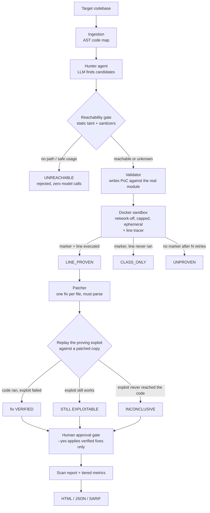

# Sentinel — Autonomous AppSec Agent

[](https://github.com/rahulpaul-07/Sentinel-Autonomous-AppSec-Agent/actions/workflows/ci.yml)
[](LICENSE)
[](https://www.python.org)

**[Project page →](https://rahulpaul-07.github.io/Sentinel-Autonomous-AppSec-Agent/)**

Sentinel is an AI agent that **finds, proves, and fixes** security vulnerabilities in
source code. Unlike a typical AI scanner that *claims* bugs, Sentinel proves each one
by generating a proof-of-concept exploit, running it against the real code in a
locked-down sandbox, and **tracing whether the line it accused actually executed**.
Then it replays that exploit against its own fix, and only calls the fix verified if
the patched code ran and the exploit no longer worked.


> Sentinel's HTML report, rendered from the test suite's fixture so that every evidence
> tier appears on one page. It is the real renderer, but not a scan result; see
> `examples/render_sample_report.py`. Each finding carries its evidence tier, the
> exploit, and the trace that graded it.

---

## The problem this solves

An LLM asked to find vulnerabilities will invent some. Asked to prove one it invented,
it will often write an exploit that reproduces the vulnerability *pattern* in isolation
and prints the success marker — without ever running the code under test. The marker is
satisfied; the claim is not. Recent work on generated exploits found that re-running
them with instrumentation invalidated roughly **44%** of the ones that had passed a
marker-only check.

Those systems check the trace against a vulnerable location supplied by a **labeled
benchmark**. That measures a technique, but it cannot run on code where nobody knows the
answer yet — which is the entire use case of a scanner.

**Sentinel's approach: make the claim check itself.** The hunter asserts a class, a file,
and a line. That assertion becomes its own witness target:

```
marker printed  +  reported line executed   ->  LINE_PROVEN
marker printed  +  reported line never ran  ->  CLASS_ONLY
```

No ground truth is required, because the claim supplies the target. That is what turns
post-hoc trace validation from an evaluation-only technique into a deployable one.

---

## The evidence ladder

A scanner that answers yes/no throws away the most useful thing it knows: *how much* it
actually demonstrated. Every candidate is graded and the grade is reported.

| Tier | Rule | What it means |
|---|---|---|
| `LINE_PROVEN` | marker + reported line executed | The specific claim was demonstrated against this code. **Only these are counted as findings, and only these are patched.** |
| `CLASS_ONLY` | marker + reported line never ran | The vulnerability class is exploitable in the abstract; this line was never shown to be. Reported, never counted. |
| `UNPROVEN` | no marker after N self-correcting attempts | Could not be demonstrated. |
| `ENV_INCOMPLETE` | the target's own imports failed in the sandbox | **Nothing was tested.** The sandbox image lacks a third-party package the target imports, so the exploit died before it could try. |
| `UNREACHABLE` | rejected by static analysis, before any model call | No path from attacker input to that line, or the call is already made safely. |

Collapsing `CLASS_ONLY` into "confirmed" is exactly the overstatement this project exists
to avoid, so the two are counted separately everywhere — including in the evaluator.

---

## Architecture



### The reachability gate

Before any exploit is written, a deterministic AST taint analysis asks whether
attacker-controlled data can reach the reported line — and whether the call is already
made safely. Rejections here cost nothing, while each avoided validation saves several
model calls plus container runs.

The sanitizer half is what makes it useful on real code. On the benchmark's clean
control, tainted input genuinely *does* flow into `cursor.execute` and `subprocess.run`.
The code is safe because of *how* those calls are made, not because the data never
arrives — so a gate modelling taint alone would catch nothing:

| Claim | Location | Verdict | Why |
|---|---|---|---|
| SQL Injection | `vulnerable_app/app.py:33` | reachable | attacker data reaches `cursor.execute` |
| Command Injection | `vulnerable_app/app.py:45` | reachable | attacker data reaches `os.system` |
| SQL Injection | `safe_app/app.py:26` | **safe usage** | constant query with bound parameters |
| Command Injection | `safe_app/app.py:34` | **safe usage** | argument vector, no shell, program is not a shell |
| Hardcoded Secret | `safe_app/app.py:17` | not analyzable | env-var read is not a literal — **fails open** |

**The gate fails open by design.** It may reject only on positive evidence of no path,
never on ignorance. A gate that blocked whenever it was unsure would trade a large amount
of recall for a little precision. That last row is the gate declining to guess.

Concretely, it rejects in three cases only: no sink call near the line *and* no call
there receiving attacker data, a sink whose arguments are literals and nothing else, or
a sink made safely. A sink fed by a function parameter or any value it cannot trace gets
`no_known_source` and goes to validation, because in a library the parameter *is* the
attacker's input.

"Made safely" is checked soundly. Sanitizers are resolved through the file's imports
(`shlex.quote` is one; `urllib.parse.quote` is not), and a call counts as sanitized only
if a second taint pass, with the sanitizers treated as clean, finds no tainted argument
-- so `f"ls {quote(a)} {b}"` is not safe. `realpath` and `resolve` are deliberately not
path sanitizers: they canonicalize a path, they do not confine it. An argument vector is
shell-free only if `shell` is absent or literally `False` and the program is not itself a
shell.

### Provider-agnostic model layer

The model layer runs on a local Ollama model, Groq, Gemini, Claude, or OpenAI — switched
with one line in `.env`. Developed across Ollama, Gemini and Groq without a code change.

**Resilience.** Rate limits (429), capacity spikes (503) and dropped connections are
retried with exponential backoff, honouring the provider's own `retry-in` hint in any
unit. When that hint asks for more than a minute, as a daily token quota does, the call
stops at once with the wait the provider gave, instead of retrying something that cannot
clear. Errors retrying can't fix — a bad key, an unknown model — fail immediately.

**Fail-fast sandbox.** Docker being *installed* is not the daemon *running*. A preflight
check turns that into one clear error instead of a scan that appears to find nothing.

---

## Security model

Sentinel runs two kinds of untrusted input: the **exploit**, which a model wrote, and
the **target**, which is code nobody has vetted -- the whole point of a scanner. The
target is pasted into prompts, so it can carry instructions for the model reading it.

| Boundary | Control | Pinned by |
|---|---|---|
| Exploit vs. host | `--network none`, read-only root, 64 MB tmpfs, `--cap-drop ALL`, `--user 65534`, `no-new-privileges`, memory/swap/CPU/PID caps, 1 MB output cap inside the container, 20 s timeout | `tests/integration/test_sandbox_docker.py` |
| Exploit vs. its own grade | per-run nonce on the trace record, tracer state in closures, record written to a private descriptor, pre-execution screen for frame/trace-hook/`os._exit`/`__main__` access | `tests/test_witness_integrity.py` |
| Target vs. model | untrusted text fenced with random delimiters, untrusted-data notice in every system prompt, model output normalised to a fixed schema | `tests/test_untrusted_output.py` |
| Target vs. host files | symlinks never followed out of the target; virtualenvs and build output never read | `tests/test_tools.py` |
| Report vs. reader | every field escaped; `Content-Security-Policy: default-src 'none'` | `tests/test_untrusted_output.py` |
| Fix vs. codebase | fix must parse and change something; verified by replaying the exploit; `--yes` applies verified fixes only | `tests/test_fix_loop.py` |

`--build-env` is the one deliberate hole: `pip install` runs package code with network
while the image is built. It is opt-in for that reason.

### Audit, September 2026

A review of the pipeline against the model above. Each finding was reproduced against
the prior code first, and each fix ships with a test that fails when it is reverted.

| Severity | Finding | Fix |
|---|---|---|
| Critical | An exploit that never called the vulnerable function could be graded `LINE_PROVEN`: print a record-shaped line and `os._exit` before the harness wrote its own (the parser kept the last record), or `import __main__` and add the sink line to the tracer's module-level hit set. | Nonce-authenticated record, state in closures, private output descriptor, pre-execution screen. |
| High | The gate rejected real bugs before any exploit ran: `realpath` treated as containment, one quoted argument excusing another, `["sh", "-c", x]` treated as shell-free, `subprocess.getoutput` and `from os import system` treated as "no sink". | Sound sanitizer check, import resolution, fail open on unmodelled tainted calls, wider sink catalogue. |
| High | Model-supplied severity reached the HTML report unescaped. | Escaping, fixed severity vocabulary at parse time, CSP. |
| High | A target containing `--- END CODE ---` could close its own prompt block. | Random per-block fences. |
| Medium | Only the first proven bug per file was patched; an empty or unparseable reply was offered and applied by `--yes`; on Windows, applying a fix rewrote every line ending. | One fix per file for every finding, parse check, exploit replay, `--yes` verified-only, line endings kept. |
| Medium | Benchmark targets carried comments naming each bug and its line, which the model read. | Hints removed with line numbers kept; a test fails if they return. |
| Medium | Exploits ran as root in the container; output was captured unbounded; model calls had no timeout. | Unprivileged user, in-container output cap, 180 s request timeout. |
| Medium | Scans read virtualenvs (one model call per file), a dangling symlink aborted the hunt, and a symlink out of the target would have sent its contents to the model provider. | Shared discovery walk; out-of-target links skipped and reported. |
| Low | `--max-findings` dropped candidates silently; a project stored under a directory named `build` was mapped as empty. | Overflow recorded on the report; ignore rules apply inside the target only. |
| Deps | `aiohttp 3.14.1` (PYSEC-2026-3545/3546/3547); site toolchain `postcss 8.4.49` (two high), `esbuild` via `vite 5`. | `aiohttp 3.14.3`, `postcss 8.5.28`, `vite 6.4.3`. CI now runs `pip-audit` and `npm audit`. |

---

## Results

> **Re-measurement pending.** Every figure below predates the September 2026 audit. The
> benchmark targets then carried comments naming each bug, which the hunter could read,
> and the gate and witness fixes change grading. They are kept as the record of what was
> measured; the next run on the current code will be added to `benchmarks/results/`.

Measured by a reproducible harness (`evaluate.py`) against labeled ground truth: four
targets, five vulnerability classes (SQL injection, command injection, hardcoded secret,
path traversal, insecure deserialization) plus a clean control that should produce
nothing.

### Current pipeline (September 2026)

Measured on 24 September 2026 at commit `6a2b78d` with `groq/openai/gpt-oss-120b`,
three runs, exploits running in each target's dependency image with the network off.
The unedited record is
[`benchmarks/results/2026-09-24-eval-gpt-oss-120b.json`](benchmarks/results/2026-09-24-eval-gpt-oss-120b.json).

| Run | Strict recall (line-proven) | Permissive recall (marker printed) | False positives | What differed |
|---|---|---|---|---|
| 1 | 60% (3 of 5) | 80% (4 of 5) | 0 | the path-traversal exploit ran and failed |
| 2 | 80% (4 of 5) | 100% (5 of 5) | 0 | |
| 3 | 80% (4 of 5) | 100% (5 of 5) | 0 | |

**Strict recall 60–80%, permissive recall 80–100%, no false positives in three runs.**
What those figures do and do not show:

* **Strict recall cannot exceed 80% here.** The hardcoded secret sits on a module-level
  line, which runs only because the module is imported, and import-time execution is
  never counted as a witness. So 80% means every bug that execution *can* prove was
  proven: SQL injection, command injection and insecure deserialization in every run,
  path traversal in two of three.
* **The gap between the two readings is that one finding, in every run.** These runs do
  not show the witness catching an exploit that reproduced a vulnerability pattern in
  isolation; the only thing it demoted was a line execution cannot prove. Whether the
  witness changes grades on real code is what the [CVE benchmark](#real-world-cves) is
  for.
* **There is no precision figure.** Three or four findings were line-proven per run, too
  few to divide by. And the clean control was analysed in only one of the three runs:
  in the other two, the model's reply for it could not be parsed, so the file was never
  examined. (This run predates capturing the reply itself; later diagnostic calls on the
  same file caught one, a reply that closed its findings list twice.) In the run where it
  was read, its one candidate was rejected by the static
  gate before any exploit ran. The hunter now asks again when a reply is malformed
  (`2ae9118`); a re-run on that commit will replace this measurement.
* **Five cases is a small benchmark.** One case moves recall by 20 points, so a single
  run says little on its own; that is why the range is reported, not the best run.

### v1 results (August 2026)

> **These numbers measure the v1 validator, not the current pipeline.** They were taken
> before the execution witness, the reachability gate and the evidence tiers existed.
> The v1 validator told the model to write a *self-contained* exploit that did not
> import the target, so every "proof" in the table reproduced the vulnerability pattern
> in isolation. Under today's ladder that is `CLASS_ONLY` at best. They are kept because
> they are what was measured.

Scores vary **by model** and, even at temperature 0, **between runs on the same model**
— hosted providers are not bit-reproducible.

| Run | Model | Precision | Recall | F1 | Note |
|---|---|---|---|---|---|
| 1 | `gemini/gemini-3.5-flash` | 100% | 80% | 0.89 | missed insecure deserialization |
| 2 | `groq/openai/gpt-oss-120b` | 100% | 100% | 1.00 | all five classes reproduced |
| 3 | `groq/openai/gpt-oss-120b` | 71% | 100% | 0.83 | 2 false positives on the clean control |

The honest summary of v1 is the range: **precision 71–100%, recall 80–100%**.

### Tiered scoring

`evaluate_target_tiered()` scores the same scan twice — once counting any finding whose
exploit printed the marker (the permissive reading a marker-only tool reports), once
counting only line-proven findings. **The gap between those two numbers is the amount a
marker-only scanner overstates.** Measuring it was not possible before the witness
existed. On the four benchmark targets the gap is one finding per run, the hardcoded
secret, for the structural reason given above.

### The self-correction result (v1)

Recall on the two hardest classes initially came in at 60%. Adding a self-correction loop
to the validator — feed a failed exploit's output back to the model and retry — raised
recall to 100% while precision held: a measurable gain from a specific change, which is
what the harness exists to prove.

> **Note on the numbers.** Five cases is far too few to quote a single figure from with
> confidence. The value is the methodology — every change is measurable. In v1 the
> harness caught a model-dependent recall drop and a precision drop on the clean control;
> in September it caught a clean control that was never analysed at all.

### Real-world CVEs

[`benchmarks/cves/`](benchmarks/cves/README.md) scans published vulnerabilities in real
projects at the vulnerable commit and at the fixed one, with the scoring rules written
down before any run. `sentinel-cve --runs 3` runs it. **The manifest has no cases yet**,
so there are no real-world numbers. Each case needs a hand-checked sink line, and the
harness refuses to run on an empty manifest rather than print a number.

---

## Quickstart

**Prerequisites:** Python **3.12**, Docker, and one model provider — a free
[Groq](https://console.groq.com) or [Gemini](https://aistudio.google.com) key, a local
[Ollama](https://ollama.com) model, or an Anthropic/OpenAI key.

> Python 3.13+ is not currently supported: the pinned `litellm` release targets `<3.14`.

```bash
# 1. Set up the environment
python3.12 -m venv .venv
source .venv/bin/activate          # Windows: .\.venv\Scripts\Activate.ps1
pip install -e .                   # installs the package + `sentinel` command

# 2. Configure a model
cp .env.example .env               # Windows: Copy-Item .env.example .env

# 3. Scan a target, and write a self-contained HTML report (Docker must be running;
#    --build-env installs the target's Flask dependency into the sandbox image)
sentinel targets/vulnerable_app --build-env --report report.html --open

#    In CI: SARIF for code scanning, and fail the job on a proven high/critical bug
sentinel src/ --no-patch --sarif sentinel.sarif --fail-on high

# 4. Measure accuracy — average five runs and report the spread
sentinel-eval --runs 5
```

`sentinel-eval` needs Docker running and refuses to start without it; otherwise every
exploit would fail to launch and score like a model that found nothing. Each run prints,
per target, the sandbox image and how every candidate was graded, then the strict and
permissive scores. A ratio with nothing to divide by prints `n/a`, never 100%. A target
with no candidates says whether the model reported none or its reply was unreadable. A
malformed reply is requested once more; if that one is malformed too, the file is reported
unreadable with the full reply and the parse error. The
`--json` record carries the model, the commit, a flag for uncommitted changes and the
tokens each run used, and is written after every run. If a provider's usage limit stops
the evaluation, the finished runs are kept and `--resume` completes them later; results
worth publishing go in [`benchmarks/results/`](benchmarks/results/README.md).

### Command-line options

| Flag | Effect |
|---|---|
| `--report PATH` | Write a self-contained HTML report (no script, no external requests) |
| `--json PATH` | Write machine-readable JSON results |
| `--sarif PATH` | Write SARIF 2.1.0: line-proven findings as errors, class-only as warnings, nothing weaker |
| `--open` | Open the HTML report when done (needs `--report`) |
| `--fail-on SEVERITY` | Exit 1 if a line-proven finding is at or above `low`/`medium`/`high`/`critical`; unknown severity fails closed |
| `--no-validate` | Skip sandbox validation (findings stay `UNPROVEN`) |
| `--no-patch` | Do not generate secure-fix diffs |
| `--no-verify-fix` | Do not replay the proving exploit against a proposed fix |
| `--no-gate` | Disable the static reachability gate (validate every candidate) |
| `--show-class-only` | List findings whose exploit never reached the reported line |
| `--min-confidence F` | Skip validating candidates below this hunter confidence |
| `--max-findings N` | Grade at most N candidates, highest confidence first; the rest are listed on the report |
| `--build-env` | Build a sandbox image with the target's declared dependencies (opt-in: runs `pip install` with network) |
| `--yes` | Apply fixes without prompting -- only fixes whose replayed exploit no longer succeeds |

Exit codes: `0` done, `1` a finding met `--fail-on`, `2` bad arguments or no model
configured, `3` Docker unusable, `4` the provider's usage limit stopped the scan, `5` the
provider refused the request (bad key, unknown model, outage after retries).
`SENTINEL_LLM_TIMEOUT` sets the per-request model timeout (default 180 s).

A minimal GitHub Actions step:

```yaml
- name: Sentinel
  env:
    SENTINEL_MODEL: groq/openai/gpt-oss-120b
    GROQ_API_KEY: ${{ secrets.GROQ_API_KEY }}
  run: |
    pip install git+https://github.com/rahulpaul-07/Sentinel-Autonomous-AppSec-Agent
    sentinel src/ --no-patch --sarif sentinel.sarif --fail-on high
- uses: github/codeql-action/upload-sarif@v3
  if: always()
  with:
    sarif_file: sentinel.sarif
```

---

## Tests

```bash
pip install -e ".[dev]" && pytest -q   # 338 tests, a few seconds, offline
pytest -m docker                       # 15 more, against a real Docker daemon
ruff check                             # lint, including bandit security rules
```

CI also runs `pip-audit` on the pinned lockfile and `npm audit` on the site, and checks
that the analysis modules import with nothing but pytest installed.

The default suite runs **offline** — no Docker, no API key. The two boundaries that touch
the outside world (the LLM and the container) are stubbed, and the tests assert on how
they are *called*, not only on what they return. A separate set marked `docker` stubs
only the model: the real `docker run`, the security flags, the read-only mount, the
in-container tracer and the grading all execute. CI runs both. The witness tests go further and actually **execute** the tracing
harness in a subprocess against a real target file, proving it genuinely distinguishes an
exploit that drives the target from one that only reproduces the pattern.

Bugs found in the grading, each pinned with a regression test that fails when the fix is
reverted:

* **Import-time false proof.** Importing a module executes every top-level statement.
  With a line window, a PoC that did nothing but `import app` registered as reaching
  any nearby module-level line, including the hardcoded secret in the benchmark. The
  first fix excluded only `def` headers; the tracer now discards every line executed
  while the target's own module frame is on the stack.
* **Forged proofs by basename.** Tracing matched frames by file name, so Flask's own
  `app.py` could satisfy a claim about the target's `app.py`. Frames are now matched by
  resolved path.
* **Nothing was mounted.** The validator never passed the target directory to the
  sandbox, so every exploit died on import while every stubbed test passed. The Docker
  tests exist because of this one.
* **Untestable graded as failed.** A missing third-party package was reported as a
  failed exploit; it is now its own tier.
* A section header counted rejected findings by subtracting class-only ones, but
  class-only findings are confirmed and were never in that set.
* **Self-graded proofs.** See the [September 2026 audit](#audit-september-2026): an
  exploit could forge its own trace record. Pinned by `tests/test_witness_integrity.py`,
  which runs each forgery through the real harness.

---

## The project page

`docs/` holds a built React site (source in `site/`), served by GitHub Pages:

```bash
cd site && npm install && npm run build   # outputs to ../docs
```

---

## Limitations & roadmap

* **Dependencies need `--build-env`.** By default the sandbox is a bare Python image, so
  a target importing Flask or any third-party package dies at its own import line and
  the claim is graded `ENV_INCOMPLETE`, because "we could not test this" and "the
  exploit failed" are different statements. `--build-env` bakes the target's declared
  dependencies into the image at build time. It is opt-in because `pip install` runs
  package code with network, which the sandbox does not cover. Note the asymmetry this creates with v1: the old validator reproduced
  vulnerability patterns in isolation and so never needed the target's dependencies at
  all. The new target-executing validator is strictly more honest and will report
  **lower** recall on dependency-heavy targets. That is the measurement getting better,
  not the tool getting worse.
* **The tracer records that a line executed, not that tainted data flowed through it.**
  A line can execute with benign input. Combined with the static taint gate this is
  strong evidence — it is not a dataflow proof. Closing that gap is on the roadmap.
* The benchmark is **five cases**. Enough to make changes measurable and catch
  regressions; not enough to quote a headline accuracy number. The real-world CVE
  harness exists, but its manifest is empty until cases are labelled.
* The static gate is pattern-based, with no path sensitivity, no alias analysis, and no
  cross-module tracking. It deliberately fails open.
* **Module-level findings cannot be line-proven.** Lines that run only because the module
  was imported are never counted as a witness, so a hardcoded secret, which lives on a
  module-level line, tops out at `CLASS_ONLY`. Execution is the wrong kind of evidence
  for that class.
* **Imports follow `__init__.py`.** The validator walks up from the file while each
  directory is a package, puts the first non-package directory on `sys.path`, and
  imports the dotted path from there, so `src/pkg/db.py` is `pkg.db`. Namespace packages
  (no `__init__.py`) are imported from the file's own directory, which breaks relative
  imports inside them.
* **The tracer shares the exploit's interpreter.** The nonce, the closure-held state
  and the screen stop accidental and naively injected forgery; they do not make an
  in-process tracer tamper-proof against an exploit engineered to evade the screen.
  Tracing from outside the process is on the roadmap.
* **Prompt injection is reduced, not removed.** Fencing makes it harder for the target to
  address the model, but the model still reads it. An injected *finding* still has to be
  proven by execution; an injected "report nothing" is the residual risk.
* **Fix verification is a regression check, not a proof of absence.** It shows the exploits
  that proved the finding no longer work against the patched code; another exploit might.
* `sys.settrace` does not see into C extensions and conflicts with debuggers or coverage
  tools sharing the hook.
* Validation requires a running Docker daemon.

## Shipped since v1

* Evidence ladder replacing binary confirmed/rejected, with the execution witness
* Static reachability gate with sanitizer recognition, running before any model call
* Tiered evaluation (permissive vs. strict) to quantify marker-only overstatement
* Self-contained HTML report with per-finding witness and gate reasoning
* Installable package (`sentinel`, `sentinel-eval`), argparse CLI, JSON output
* Offline test suite, plus Docker tests that exercise the real sandbox in CI
* Per-target sandbox images built from declared dependencies (`--build-env`)
* Imports resolved from the package tree, so `src/pkg/db.py` is `pkg.db`
* CVE benchmark harness with pre-registered scoring (`sentinel-cve`), no cases yet
* Built project page under `docs/`

## Shipped in the September 2026 audit

* Witness integrity: nonce-authenticated trace records and a pre-execution screen
* Sound sanitizer handling and fail-open behaviour for unmodelled calls in the gate
* Fix verification by exploit replay; one fix per file covering every proven finding
* SARIF 2.1.0 export and `--fail-on` for CI; clean exit codes
* Prompt fencing, output normalisation, report CSP, unprivileged sandbox, output caps
* Benchmark targets stripped of answer-key comments
* ruff (with bandit rules), `pip-audit` and `npm audit` in CI
* Project page rebuilt; see [CHANGELOG.md](CHANGELOG.md)

## License

MIT — see [LICENSE](LICENSE).
