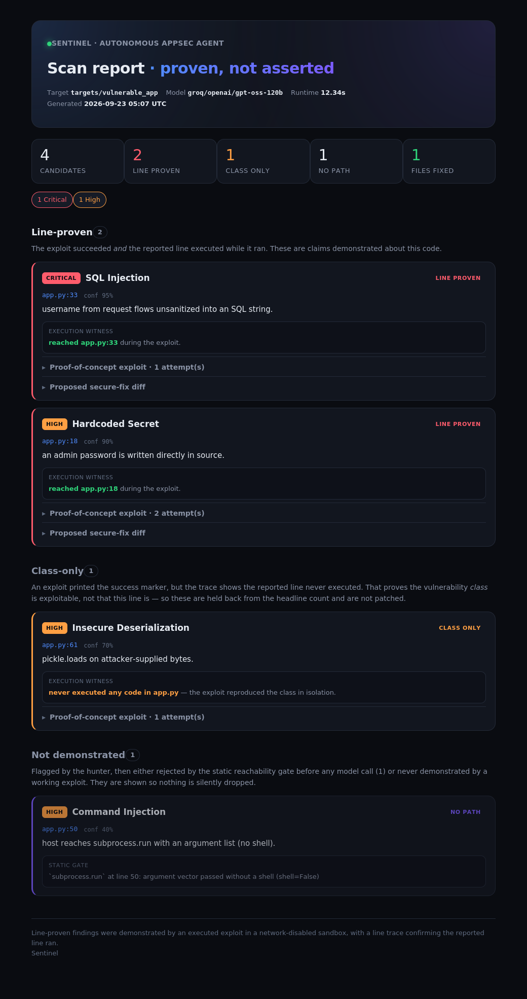
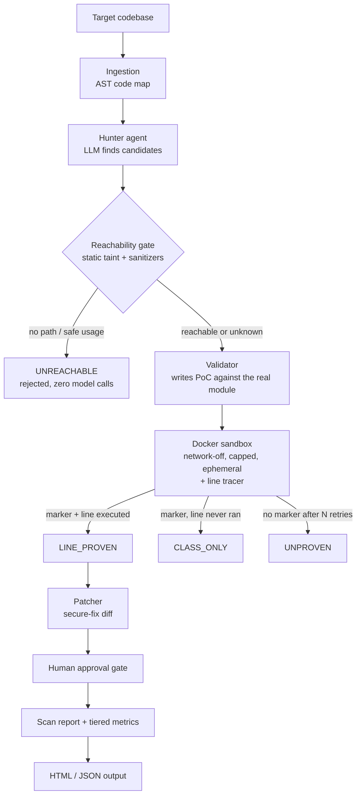

# Sentinel — Autonomous AppSec Agent

[](https://github.com/rahulpaul-07/Sentinel-Autonomous-AppSec-Agent/actions/workflows/ci.yml)
[](LICENSE)
[](https://www.python.org)

**[Project page →](https://rahulpaul-07.github.io/Sentinel-Autonomous-AppSec-Agent/)**

Sentinel is an AI agent that **finds, proves, and fixes** security vulnerabilities in
source code. Unlike a typical AI scanner that *claims* bugs, Sentinel proves each one
by generating a proof-of-concept exploit, running it against the real code in a
locked-down sandbox, and **tracing whether the line it accused actually executed**.



> Sentinel's HTML report, rendered from the test suite's fixture so that every evidence
> tier appears on one page. It is the real renderer, but not a scan result; see
> `examples/render_sample_report.py`. Each finding carries its evidence tier, the
> exploit, and the trace that graded it.

---

## The problem this solves

An LLM asked to find vulnerabilities will invent some. Asked to prove one it invented,
it will often write an exploit that reproduces the vulnerability *pattern* in isolation
and prints the success marker — without ever running the code under test. The marker is
satisfied; the claim is not. Recent work on generated exploits found that re-running
them with instrumentation invalidated roughly **44%** of the ones that had passed a
marker-only check.

Those systems check the trace against a vulnerable location supplied by a **labeled
benchmark**. That measures a technique, but it cannot run on code where nobody knows the
answer yet — which is the entire use case of a scanner.

**Sentinel's approach: make the claim check itself.** The hunter asserts a class, a file,
and a line. That assertion becomes its own witness target:

```
marker printed  +  reported line executed   ->  LINE_PROVEN
marker printed  +  reported line never ran  ->  CLASS_ONLY
```

No ground truth is required, because the claim supplies the target. That is what turns
post-hoc trace validation from an evaluation-only technique into a deployable one.

---

## The evidence ladder

A scanner that answers yes/no throws away the most useful thing it knows: *how much* it
actually demonstrated. Every candidate is graded and the grade is reported.

| Tier | Rule | What it means |
|---|---|---|
| `LINE_PROVEN` | marker + reported line executed | The specific claim was demonstrated against this code. **Only these are counted as findings, and only these are patched.** |
| `CLASS_ONLY` | marker + reported line never ran | The vulnerability class is exploitable in the abstract; this line was never shown to be. Reported, never counted. |
| `UNPROVEN` | no marker after N self-correcting attempts | Could not be demonstrated. |
| `ENV_INCOMPLETE` | the target's own imports failed in the sandbox | **Nothing was tested.** The sandbox image lacks a third-party package the target imports, so the exploit died before it could try. |
| `UNREACHABLE` | rejected by static analysis, before any model call | No path from attacker input to that line, or the call is already made safely. |

Collapsing `CLASS_ONLY` into "confirmed" is exactly the overstatement this project exists
to avoid, so the two are counted separately everywhere — including in the evaluator.

---

## Architecture



### The reachability gate

Before any exploit is written, a deterministic AST taint analysis asks whether
attacker-controlled data can reach the reported line — and whether the call is already
made safely. Rejections here cost nothing, while each avoided validation saves several
model calls plus container runs.

The sanitizer half is what makes it useful on real code. On the benchmark's clean
control, tainted input genuinely *does* flow into `cursor.execute` and `subprocess.run`.
The code is safe because of *how* those calls are made, not because the data never
arrives — so a gate modelling taint alone would catch nothing:

| Claim | Location | Verdict | Why |
|---|---|---|---|
| SQL Injection | `vulnerable_app/app.py:33` | reachable | attacker data reaches `cursor.execute` |
| Command Injection | `vulnerable_app/app.py:45` | reachable | attacker data reaches `os.system` |
| SQL Injection | `safe_app/app.py:26` | **safe usage** | constant query with bound parameters |
| Command Injection | `safe_app/app.py:34` | **safe usage** | argument vector, `shell=False` |
| Hardcoded Secret | `safe_app/app.py:17` | not analyzable | env-var read is not a literal — **fails open** |

**The gate fails open by design.** It may reject only on positive evidence of no path,
never on ignorance. A gate that blocked whenever it was unsure would trade a large amount
of recall for a little precision. That last row is the gate declining to guess.

### Provider-agnostic model layer

The model layer runs on a local Ollama model, Groq, Gemini, Claude, or OpenAI — switched
with one line in `.env`. Developed across Ollama, Gemini and Groq without a code change.

**Resilience.** Rate limits (429), capacity spikes (503) and dropped connections are
retried with exponential backoff, honouring the provider's own `retry-in` hint. Errors
retrying can't fix — a bad key, an unknown model — fail immediately.

**Fail-fast sandbox.** Docker being *installed* is not the daemon *running*. A preflight
check turns that into one clear error instead of a scan that appears to find nothing.

---

## Results

Measured by a reproducible harness (`evaluate.py`) against labeled ground truth: four
targets, five vulnerability classes (SQL injection, command injection, hardcoded secret,
path traversal, insecure deserialization) plus a clean control.

> **These numbers measure the v1 validator, not the current pipeline.** They were taken
> in August 2026, before the execution witness, the reachability gate and the evidence
> tiers existed. The v1 validator told the model to write a *self-contained* exploit
> that did not import the target, so every "proof" in the table reproduced the
> vulnerability pattern in isolation. Under today's ladder that is `CLASS_ONLY` at best.
> They are kept because they are what was measured, and because the tiered evaluator
> exists to show how far a marker-only check overstates. The current pipeline has not
> been benchmarked yet; `sentinel-eval --runs 5` produces that measurement.

### Reproducibility (v1, August 2026)

Scores vary **by model** and, even at temperature 0, **between runs on the same model**
— hosted providers are not bit-reproducible.

| Run | Model | Precision | Recall | F1 | Note |
|---|---|---|---|---|---|
| 1 | `gemini/gemini-3.5-flash` | 100% | 80% | 0.89 | missed insecure deserialization |
| 2 | `groq/openai/gpt-oss-120b` | 100% | 100% | 1.00 | all five classes reproduced |
| 3 | `groq/openai/gpt-oss-120b` | 71% | 100% | 0.83 | 2 false positives on the clean control |

Run 2 is the **best observed** result, not the expected one. The honest summary is the
range: **precision 71–100%, recall 80–100%** on a five-case benchmark. Because a single
run is one noisy sample, `evaluate.py --runs N` reports the mean and spread.

### Tiered scoring

`evaluate_target_tiered()` scores the same scan twice — once counting any finding whose
exploit printed the marker (the permissive reading a marker-only tool reports), once
counting only line-proven findings. **The gap between those two numbers is the amount a
marker-only scanner overstates.** Measuring it was not possible before the witness
existed.

### The self-correction result (v1)

Recall on the two hardest classes initially came in at 60%. Adding a self-correction loop
to the validator — feed a failed exploit's output back to the model and retry — raised
recall to 100% while precision held: a measurable gain from a specific change, which is
what the harness exists to prove.

> **Note on the numbers.** Five cases is far too few to quote a single figure from with
> confidence. The value is the methodology — every change is measurable, and the harness
> caught both the model-dependent recall regression in run 1 and the precision drop in
> run 3 before either went unnoticed. Expanding the benchmark with real-world CVEs is the
> top roadmap item.

---

## Quickstart

**Prerequisites:** Python **3.12**, Docker, and one model provider — a free
[Groq](https://console.groq.com) or [Gemini](https://aistudio.google.com) key, a local
[Ollama](https://ollama.com) model, or an Anthropic/OpenAI key.

> Python 3.13+ is not currently supported: the pinned `litellm` release targets `<3.14`.

```bash
# 1. Set up the environment
python3.12 -m venv .venv
source .venv/bin/activate          # Windows: .\.venv\Scripts\Activate.ps1
pip install -e .                   # installs the package + `sentinel` command

# 2. Configure a model
cp .env.example .env               # Windows: Copy-Item .env.example .env

# 3. Scan a target, and write a self-contained HTML report
sentinel targets/vulnerable_app --report report.html --open

# 4. Measure accuracy — average five runs and report the spread
sentinel-eval --runs 5
```

### Command-line options

| Flag | Effect |
|---|---|
| `--report PATH` | Write a self-contained HTML report (no external requests) |
| `--json PATH` | Write machine-readable JSON results |
| `--open` | Open the HTML report when done |
| `--no-validate` | Skip sandbox validation (findings stay `UNPROVEN`) |
| `--no-patch` | Do not generate secure-fix diffs |
| `--no-gate` | Disable the static reachability gate (validate every candidate) |
| `--show-class-only` | List findings whose exploit never reached the reported line |
| `--min-confidence F` | Skip validating candidates below this hunter confidence |
| `--build-env` | Build a sandbox image with the target's declared dependencies (opt-in: runs `pip install` with network) |
| `--yes` | Auto-apply every proposed fix without prompting |

---

## Tests

```bash
pip install pytest && pytest -q     # 113 tests, about a second, offline
pytest -m docker                    # 12 more, against a real Docker daemon
```

The default suite runs **offline** — no Docker, no API key. The two boundaries that touch
the outside world (the LLM and the container) are stubbed, and the tests assert on how
they are *called*, not only on what they return. A separate set marked `docker` stubs
only the model: the real `docker run`, the security flags, the read-only mount, the
in-container tracer and the grading all execute. CI runs both. The witness tests go further and actually **execute** the tracing
harness in a subprocess against a real target file, proving it genuinely distinguishes an
exploit that drives the target from one that only reproduces the pattern.

Bugs found in the grading, each pinned with a regression test that fails when the fix is
reverted:

* **Import-time false proof.** Importing a module executes every top-level statement.
  With a line window, a PoC that did nothing but `import app` registered as reaching
  any nearby module-level line, including the hardcoded secret in the benchmark. The
  first fix excluded only `def` headers; the tracer now discards every line executed
  while the target's own module frame is on the stack.
* **Forged proofs by basename.** Tracing matched frames by file name, so Flask's own
  `app.py` could satisfy a claim about the target's `app.py`. Frames are now matched by
  resolved path.
* **Nothing was mounted.** The validator never passed the target directory to the
  sandbox, so every exploit died on import while every stubbed test passed. The Docker
  tests exist because of this one.
* **Untestable graded as failed.** A missing third-party package was reported as a
  failed exploit; it is now its own tier.
* A section header counted rejected findings by subtracting class-only ones, but
  class-only findings are confirmed and were never in that set.

---

## The project page

`docs/` holds a built React site (source in `site/`), served by GitHub Pages:

```bash
cd site && npm install && npm run build   # outputs to ../docs
```

---

## Limitations & roadmap

* **Dependencies need `--build-env`.** By default the sandbox is a bare Python image, so
  a target importing Flask or any third-party package dies at its own import line and
  the claim is graded `ENV_INCOMPLETE`, because "we could not test this" and "the
  exploit failed" are different statements. `--build-env` bakes the target's declared
  dependencies into the image at build time. It is opt-in because `pip install` runs
  package code with network, which the sandbox does not cover. Note the asymmetry this creates with v1: the old validator reproduced
  vulnerability patterns in isolation and so never needed the target's dependencies at
  all. The new target-executing validator is strictly more honest and will report
  **lower** recall on dependency-heavy targets. That is the measurement getting better,
  not the tool getting worse.
* **The tracer records that a line executed, not that tainted data flowed through it.**
  A line can execute with benign input. Combined with the static taint gate this is
  strong evidence — it is not a dataflow proof. Closing that gap is on the roadmap.
* The benchmark is **five cases**. Enough to make changes measurable and catch
  regressions; not enough to quote a headline accuracy number. Real-world CVEs next.
* The static gate is pattern-based, with no path sensitivity, no alias analysis, and no
  cross-module tracking. It deliberately fails open.
* **Module-level findings cannot be line-proven.** Lines that run only because the module
  was imported are never counted as a witness, so a hardcoded secret, which lives on a
  module-level line, tops out at `CLASS_ONLY`. Execution is the wrong kind of evidence
  for that class.
* **Imports follow `__init__.py`.** The validator walks up from the file while each
  directory is a package, puts the first non-package directory on `sys.path`, and
  imports the dotted path from there, so `src/pkg/db.py` is `pkg.db`. Namespace packages
  (no `__init__.py`) are imported from the file's own directory, which breaks relative
  imports inside them.
* `sys.settrace` does not see into C extensions and conflicts with debuggers or coverage
  tools sharing the hook.
* Validation requires a running Docker daemon.

## Shipped since v1

* Evidence ladder replacing binary confirmed/rejected, with the execution witness
* Static reachability gate with sanitizer recognition, running before any model call
* Tiered evaluation (permissive vs. strict) to quantify marker-only overstatement
* Self-contained HTML report with per-finding witness and gate reasoning
* Installable package (`sentinel`, `sentinel-eval`), argparse CLI, JSON output
* Offline test suite, plus Docker tests that exercise the real sandbox in CI
* Per-target sandbox images built from declared dependencies (`--build-env`)
* Built project page under `docs/`

## License

MIT — see [LICENSE](LICENSE).
