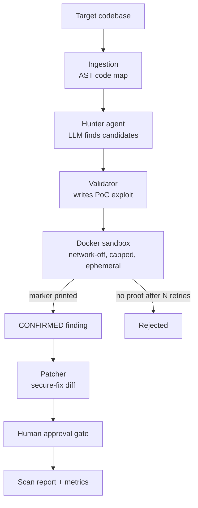

# Sentinel — Autonomous AppSec Agent

[](https://github.com/rahulpaul-07/sentinel-Autonomous-AppSec-Agent/actions/workflows/ci.yml)
[](LICENSE)

Sentinel is an AI agent that **finds, proves, and fixes** security vulnerabilities in source code. Unlike a typical AI scanner that just *claims* bugs, Sentinel tries to **prove** each one by generating a proof-of-concept exploit and running it inside a locked-down sandbox — so what it reports has been demonstrated, not asserted.

Inspired by the cyber-reasoning systems from DARPA's AI Cyber Challenge (2025), scoped as a single-developer build.

<!-- TODO: record a ~20s capture of `python scan.py targets/vulnerable_app` reaching a
     CONFIRMED finding, save as docs/demo.gif, and embed it here. -->

---

## Why it's different

Most LLM-based scanners produce a list of *claims*, many of which are hallucinated or wrong. Sentinel adds a **validation loop**: every candidate finding must be demonstrated by an executed exploit before it's reported. A claim that can't be proven is discarded.

This cuts false positives sharply, but it does not eliminate them. In v1 the proof-of-concept **reproduces the vulnerability pattern in isolation** rather than executing the target code itself, so it establishes that the reported *class* is exploitable — not that the *specific line* is. Where the hunter misreads safe code as vulnerable, a class-level exploit can still confirm it. [Limitations](#limitations--roadmap) documents a measured example.

That gap is the most interesting open problem in the project, and closing it is the top item on the roadmap.

---

## Architecture



The model layer is **provider-agnostic** (via LiteLLM): the same code runs on a local Ollama model, Groq, Google Gemini, Anthropic Claude, or OpenAI — switched with one line in `.env`. During development this project was run across Ollama, Gemini and Groq without a single code change, which is what the abstraction exists for.

**Resilience.** Transient provider failures — rate limits (429), capacity spikes (503), dropped connections — are retried with exponential backoff, honouring the provider's own `retry-in` hint when it supplies one. Errors that retrying can't fix, such as a bad API key or an unknown model name, fail immediately. With a dozen-plus model calls per scan, one unhandled blip previously discarded every finding already proven.

---

## Results

Measured by a reproducible evaluation harness (`evaluate.py`) against labeled ground truth, across four targets spanning five vulnerability classes (SQL injection, command injection, hardcoded secret, path traversal, insecure deserialization) plus a clean control.

### Reproducibility

Results were measured in August 2026. Scores vary **by model** and, even at temperature 0, **between runs on the same model** — hosted providers are not bit-reproducible. Three consecutive runs on the current benchmark:

| Run | Model | Precision | Recall | F1 | Note |
|---|---|---|---|---|---|
| 1 | `gemini/gemini-3.5-flash` | 100% | 80% | 0.89 | missed insecure deserialization |
| 2 | `groq/openai/gpt-oss-120b` | 100% | 100% | 1.00 | all five classes proven |
| 3 | `groq/openai/gpt-oss-120b` | 71% | 100% | 0.83 | 2 false positives on the clean control |

Run 2 is the **best observed** result, not the expected one. The honest summary is the range: **precision 71–100%, recall 80–100%** on a five-case benchmark.

### Best observed run (run 2, per target)

| Target | True Pos. | False Pos. | False Neg. |
|---|---|---|---|
| `vulnerable_app` (3 bugs) | 3 | 0 | 0 |
| `safe_app` (clean control) | 0 | 0 | 0 |
| `traversal_app` (1 bug) | 1 | 0 | 0 |
| `deserialize_app` (1 bug) | 1 | 0 | 0 |

**Precision 100% · Recall 100% · F1 1.00**

### The self-correction result

Recall on the two hardest classes initially came in at 60%. Adding a **self-correction loop** to the validator — feed a failed exploit's output back to the model and retry — raised recall to 100% while precision held at 100%: a measurable gain from a specific change, which is what the harness exists to prove.

> **Note on the numbers.** Five cases is far too few to quote a single figure from with
> confidence. The value here is the methodology — every change is measurable, and the
> harness caught both the model-dependent recall regression in run 1 and the precision
> drop in run 3 before either went unnoticed. Expanding the benchmark with real-world
> CVEs, and reporting mean and variance across repeated runs rather than one figure,
> are the top roadmap items.

---

## Quickstart

**Prerequisites:** Python **3.12**, Docker, and one model provider — a free [Groq](https://console.groq.com) or [Gemini](https://aistudio.google.com) key, a local [Ollama](https://ollama.com) model, or an Anthropic/OpenAI key.

> Python 3.13+ is not currently supported: the pinned `litellm` release targets `<3.14`.

```bash
# 1. Set up the environment
python3.12 -m venv .venv
source .venv/bin/activate          # Windows: .\.venv\Scripts\Activate.ps1
pip install -r requirements.txt

# 2. Configure a model
cp .env.example .env               # Windows: Copy-Item .env.example .env
# then edit .env — see the table below

# 3. Scan a target (find -> prove -> propose fixes, with approval)
python scan.py targets/vulnerable_app

# 4. Measure accuracy against the labeled benchmark
python evaluate.py
```

### Choosing a model

Set `SENTINEL_MODEL` in `.env` to any string LiteLLM understands:

| Provider | `SENTINEL_MODEL` | Key variable | Notes |
|---|---|---|---|
| Groq | `groq/openai/gpt-oss-120b` | `GROQ_API_KEY` | Free tier; generous daily quota, ~8k tokens/min |
| Google | `gemini/gemini-3.5-flash` | `GEMINI_API_KEY` | Free tier capped at 20 requests/day **per model** |
| Ollama (local) | `ollama/qwen2.5-coder:7b` | — | No key, no quota, no network |
| Anthropic | `claude-sonnet-5` | `ANTHROPIC_API_KEY` | Paid |
| OpenAI | `gpt-4o-mini` | `OPENAI_API_KEY` | Paid |

A full `evaluate.py` run makes roughly 12–20 model calls. On rate-limited free tiers the retry logic absorbs the throttling and completes, just more slowly — Gemini's 20/day cap allows about one evaluation run per model per day.

Docker Desktop must be **running**, not merely installed — the sandbox is where every exploit executes.

---

## How it works

| Stage | Module | What it does |
|---|---|---|
| Model layer | `sentinel/llm.py` | Provider-agnostic LLM client (Adapter pattern) with retry/backoff |
| Ingestion | `sentinel/ingest.py` | Builds an AST code map of the target |
| Tools | `sentinel/tools.py` | Read-only, path-scoped investigation tools |
| Hunter | `sentinel/hunter.py` | LLM produces structured candidate findings |
| Sandbox | `sentinel/sandbox.py` | Isolated Docker execution (no network, capped, timed) |
| Validator | `sentinel/validator.py` | Attempts to prove findings via executed PoC exploit |
| Patcher | `sentinel/patcher.py` | Generates secure-fix diffs (difflib) |
| Orchestrator | `sentinel/scanner.py` | Coordinates the pipeline into one `ScanReport` |
| Evaluation | `sentinel/evaluation.py` | Precision / recall / F1 vs. ground truth |

The validator's **self-correction loop** is the core agentic pattern: the agent observes the result of its own action and, when it fails, uses that feedback to improve the next attempt — up to `max_attempts` times — before discarding the claim.

---

## Tech stack

Python 3.12 · LiteLLM (swappable models) · Groq / Gemini / Ollama / Claude / OpenAI · Docker · Python `ast` · `difflib` · Flask (test targets) · pytest · GitHub Actions

---

## Safety & ethics

- Only run Sentinel against code you own or are explicitly authorized to test.
- All exploit code runs in an isolated, network-disabled, resource-capped, ephemeral Docker container.
- This is a defensive AppSec tool; proof-of-concepts stay inside the sandbox.
- Every proposed fix is shown as a diff and applied only on explicit approval. An agent that rewrites your source unsupervised is a worse problem than the bug.

---

## Limitations & roadmap

### Validation scope — and the false positives it permits

The PoC prompt instructs the model to recreate the vulnerable pattern in plain Python rather than import the target, so the sandbox proves *"this class is exploitable"*, not *"this line is exploitable."*

Measured consequence: on `targets/safe_app`, the hunter flagged

```python
subprocess.run(["ping", "-c", "1", host], capture_output=True, text=True)
```

as command injection. That call uses the argument-list form with no shell, so it is **not** command-injectable — but the validator wrote a PoC around `os.system("ping " + payload)`, exploited *that*, and confirmed the finding. One to two false positives appeared on the clean control across runs.

The underlying input *is* unvalidated, which does permit **argument injection** (`host="-f"`, `-w`, and similar) — a real but different class. The finding was mislabelled, not baseless.

**v2 fix:** mount the target file into the sandbox and require the PoC to import and exploit the actual code path, so a proof binds to the *instance* rather than the *class*. Where the target can't be driven directly, report `unconfirmed — class-level only` rather than collapsing the distinction into a confirmation.

### Other known limits and next steps

- **Benchmark size** — small and hand-labeled; expanding with real CVEs is the priority.
- **Run-to-run variance** — a single run is one sample. The harness should run N times and report mean and spread.
- **Language coverage** — Python only; more languages via tree-sitter.
- **Candidate generation** — Semgrep integration to complement the LLM hunter.
- **Orchestration** — LangGraph with resumable human-in-the-loop.
- **CI** — run the eval on every push so regressions surface automatically.
- **Reporting** — a web dashboard over `ScanReport`.

---

## License

MIT — see [LICENSE](LICENSE).