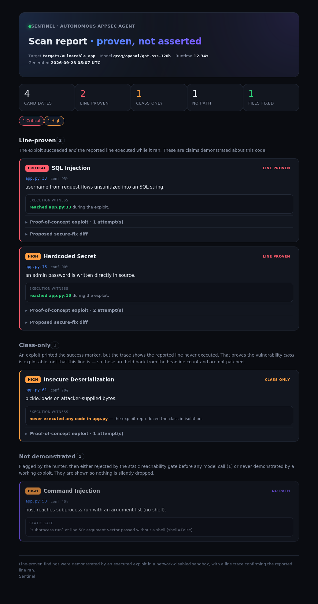
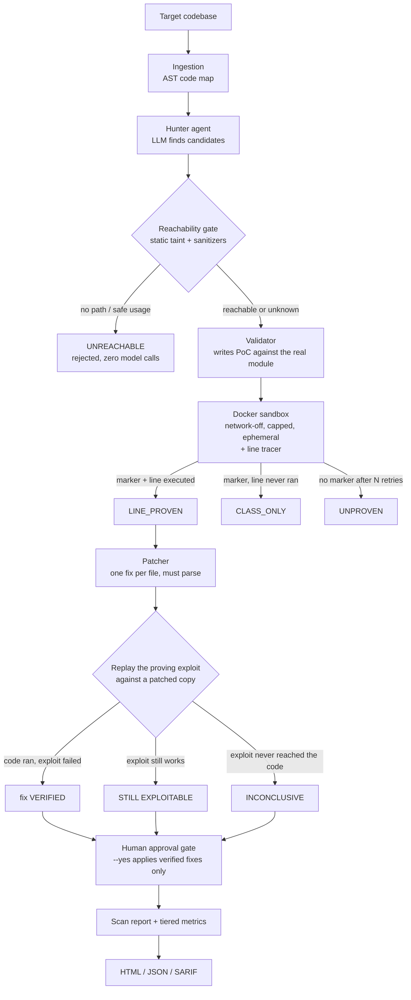

# Sentinel — an AppSec agent that proves its findings

[](https://github.com/rahulpaul-07/Sentinel-Autonomous-AppSec-Agent/actions/workflows/ci.yml)
[](LICENSE)
[](https://www.python.org)

**[Project page](https://rahulpaul-07.github.io/Sentinel-Autonomous-AppSec-Agent/)** ·
**[Sample report](https://rahulpaul-07.github.io/Sentinel-Autonomous-AppSec-Agent/sample-report.html)** ·
**[Measured results](benchmarks/results/README.md)** ·
**[Changelog](CHANGELOG.md)**

Sentinel uses an LLM to find security vulnerabilities in Python code. It does not trust
what the model says. For each finding, it gets the model to write an exploit and runs it
against the real code in a locked-down Docker container, with a line tracer watching.
The finding is graded by what actually executed. Sentinel then writes a fix and replays
the same exploit against the patched code to check it.



> The HTML report, rendered from the test suite's fixture so that every evidence tier
> appears on one page. It is the real renderer, not a scan result
> (`examples/render_sample_report.py`).

### At a glance

| | |
|---|---|
| **Core idea** | A finding names a file and a line. Its exploit is run under a tracer, and the finding counts only if that line executed. No labelled ground truth is needed, so the check works on unlabelled code. |
| **Pipeline** | LLM hunter → static taint gate (AST) → exploit in a Docker sandbox under `sys.settrace` → five-tier grading → patch → exploit replay against the patch |
| **Hardening** | Network-off, read-only, unprivileged container; nonce-authenticated trace records; prompt fencing against injection from scanned code; CSP-locked HTML report |
| **Output** | Self-contained HTML, JSON, SARIF 2.1.0 for GitHub code scanning, and `--fail-on` for CI |
| **Models** | Any provider [litellm](https://github.com/BerriAI/litellm) supports. Developed on Ollama, Groq and Gemini; Anthropic and OpenAI configure the same way. |
| **Measured** | Strict recall 60–80% and strict precision 75–100% over three runs on a five-bug benchmark. Two of the runs had a false proof on the clean control, which is disclosed and still open. [Details](#results). |
| **Tests** | 340 offline tests plus 15 against a real Docker daemon. CI also runs lint (with bandit rules), dependency audits and a site-drift check. |

## Contents

- [The problem](#the-problem)
- [How it works](#how-it-works)
- [Results](#results)
- [Quickstart](#quickstart)
- [Security model](#security-model)
- [Testing and CI](#testing-and-ci)
- [Project layout](#project-layout)
- [Limitations and roadmap](#limitations-and-roadmap)

---

## The problem

Ask an LLM to find vulnerabilities and it will invent some. Ask it to prove one it
invented and it will often write an exploit that reproduces the vulnerability *pattern*
on its own. It prints the success marker without ever running the code under test. The
marker says yes; the claim was never tested.

This is measurable. PoC-Gym ([arXiv:2602.04165](https://arxiv.org/abs/2602.04165),
§5.1) re-checked LLM-written Java exploits against the known vulnerable locations. It
found that **44%** of the exploits its runtime check had accepted never reached the real
sink. That check needs ground truth: someone has to know where the bug is. A scanner
runs on code where nobody knows the answer yet.

**Sentinel makes the claim check itself.** The hunter reports a class, a file and a
line, and that line becomes the target of its own exploit's trace:

```
marker printed  +  reported line executed   ->  LINE_PROVEN
marker printed  +  reported line never ran  ->  CLASS_ONLY
```

No labels are needed because the claim supplies the target, so the check can run on
unlabelled code.

---

## How it works


```mermaid
flowchart TD
    A[Target codebase] --> B[Ingestion<br/>AST code map]
    B --> C[Hunter agent<br/>LLM finds candidates]
    C --> G{Reachability gate<br/>static taint + sanitizers}
    G -->|no path / safe usage| X[UNREACHABLE<br/>rejected, zero model calls]
    G -->|reachable or unknown| D[Validator<br/>writes PoC against the real module]
    D --> E[Docker sandbox<br/>network-off, capped, ephemeral<br/>+ line tracer]
    E -->|marker + line executed| F[LINE_PROVEN]
    E -->|marker, line never ran| CO[CLASS_ONLY]
    E -->|no marker after N retries| U[UNPROVEN]
    F --> H[Patcher<br/>one fix per file, must parse]
    H --> V{Replay the proving exploit<br/>against a patched copy}
    V -->|code ran, exploit failed| VF[fix VERIFIED]
    V -->|exploit still works| VS[STILL EXPLOITABLE]
    V -->|exploit never reached the code| VI[INCONCLUSIVE]
    VF --> I[Human approval gate<br/>--yes applies verified fixes only]
    VS --> I
    VI --> I
    I --> J[Scan report + tiered metrics]
    J --> K[HTML / JSON / SARIF]
```

### The evidence ladder

A scanner that answers yes or no throws away its most useful information: how much it
actually showed. Sentinel grades every candidate and reports the grade.

| Tier | Rule | What it means |
|---|---|---|
| `LINE_PROVEN` | marker + reported line executed | The specific claim was demonstrated against this code. **Only these count as findings, and only these are patched.** |
| `CLASS_ONLY` | marker + reported line never ran | The vulnerability class works in the abstract, but this line was never shown to be exploitable. Reported, never counted. |
| `UNPROVEN` | no marker after N self-correcting attempts | Could not be demonstrated. |
| `ENV_INCOMPLETE` | the target's own imports failed in the sandbox | **Nothing was tested.** The sandbox lacks a package the target imports. |
| `UNREACHABLE` | rejected by static analysis, before any model call | No path from attacker input to that line, or the call is already made safely. |

Counting `CLASS_ONLY` as "confirmed" is the overstatement this project exists to avoid,
so the two tiers are counted separately everywhere, including in the evaluator.

### The reachability gate

Before any exploit is written, a deterministic AST taint analysis checks two things:
whether attacker-controlled data can reach the reported line, and whether the call is
already made safely. Rejections here cost no model calls and no container runs.

The sanitizer half is what makes it useful on real code. In the benchmark's clean
control, tainted input really *does* reach `cursor.execute` and `subprocess.run`. The
code is safe because of *how* those calls are made, so a gate that modelled taint alone
would reject nothing:

| Claim | Location | Verdict | Why |
|---|---|---|---|
| SQL Injection | `vulnerable_app/app.py:33` | reachable | attacker data reaches `cursor.execute` |
| Command Injection | `vulnerable_app/app.py:45` | reachable | attacker data reaches `os.system` |
| SQL Injection | `safe_app/app.py:26` | **safe usage** | constant query with bound parameters |
| Command Injection | `safe_app/app.py:34` | **safe usage** | argument vector, no shell, program is not a shell |
| Hardcoded Secret | `safe_app/app.py:17` | not analyzable | an env-var read is not a literal, so the gate **fails open** |

**The gate fails open by design.** It rejects a candidate only on positive evidence that
no path exists, never because it is unsure. A gate that blocked whenever it was unsure
would give up a lot of recall for a little precision.

<details>
<summary>What the gate treats as sanitized, and why</summary>

Sanitizers are resolved through the file's imports: `shlex.quote` counts, but
`urllib.parse.quote` does not. A call counts as sanitized only if a second taint pass,
with the sanitizers treated as clean, finds no tainted argument. So
`f"ls {quote(a)} {b}"` is *not* safe. `realpath` and `resolve` are deliberately not path
sanitizers: they canonicalize a path but do not confine it. An argument vector counts
as shell-free only if `shell` is absent or literally `False` and the program is not a
shell itself. A sink fed by a function parameter goes on to validation, because in a
library the parameter *is* the attacker's input.

</details>

### Provider-agnostic, and resilient

All model calls go through one adapter (`sentinel/llm.py`), built on
[litellm](https://github.com/BerriAI/litellm), so changing provider is one line in
`.env`. The adapter retries rate limits (429), capacity errors (503) and dropped
connections with exponential backoff, and follows the provider's own `retry-in` hint in
any unit. If a daily quota asks for more than a minute, it stops at once and reports the
wait. Errors a retry cannot fix, such as a bad key or an unknown model, fail at once with
one clean line, not a library traceback.

---

## Results

Measured by a reproducible harness (`sentinel-eval`) against labelled ground truth. The
benchmark has four targets, five vulnerability classes (SQL injection, command
injection, hardcoded secret, path traversal, insecure deserialization) and a clean
control that should produce nothing. Every figure below comes from an unedited results
file in [`benchmarks/results/`](benchmarks/results/README.md). Each file records the
model, the commit and the sandbox image it ran with.

### Current pipeline (26 September 2026)

Measured at commit `a332400`, after the [September audit](#audit-september-2026) and
with the answer-key comments removed from the targets. Model:
`groq/openai/gpt-oss-120b`. Three runs, with exploits running in each target's dependency
image and the network off.
Record: [`2026-09-26-eval-gpt-oss-120b.json`](benchmarks/results/2026-09-26-eval-gpt-oss-120b.json).

| Run | Strict recall (line proven) | Strict precision | Permissive recall (marker printed) | False positives | What differed |
|---|---|---|---|---|---|
| 1 | 80% (4 of 5) | 80% | 100% (5 of 5) | 1, on the clean control | |
| 2 | 60% (3 of 5) | 75% | 80% (4 of 5) | 1, on the clean control | path-traversal file not analysed: the model's reply was malformed twice |
| 3 | 60% (3 of 5) | 100% | 80% (4 of 5) | 0 | the path-traversal exploit ran and failed |

**Strict recall 60–80% and strict precision 75–100%, with one false proof in two of the
three runs.** What that does and does not show:

* **Recall held with the hints removed.** SQL injection, command injection and insecure
  deserialization were line-proven in every run. Strict recall cannot go above 80% on
  this benchmark: the hardcoded secret sits on a module-level line that execution cannot
  prove, so it was graded class-only every time.
* **The clean control produced a false proof, which is a real grading weakness.** In
  runs 1 and 2 the model claimed SSRF on the control's `ping` route. The gate has no
  SSRF model for a subprocess call, so it failed open as designed. The exploit then
  changed the sandbox environment so the route *looked* exploited, ran the accused line,
  and printed the success marker itself. The tracer confirmed the line ran, so the
  finding was graded `LINE_PROVEN`. A diagnostic re-scan of the control made the same
  claim and showed the approach: plant a fake `ping` program and put it first on `PATH`.
  That attempt failed and was graded unproven. The lesson: the marker is the exploit's
  own word. This is open; see [Limitations](#limitations-and-roadmap).
* **Small numbers.** Four or five findings were line-proven per run, so one false proof
  moves precision by 20 points, and one case moves recall by 20 points. That is why the
  range is reported rather than the best run.

**A small local model, for comparison.** The same benchmark with
`ollama/qwen2.5-coder:7b`, run twice (six runs:
[run 1](benchmarks/results/2026-09-26-eval-qwen2.5-coder-7b-run1.json),
[run 2](benchmarks/results/2026-09-26-eval-qwen2.5-coder-7b-run2.json)), line-proved at
most one bug per run (strict recall 0–20%). It produced no false proofs: the gate
rejected both clean-control candidates in every run. A 7B model proposes plausible
candidates but rarely writes an exploit that works against the real code, and the ladder
reports exactly that.

### Tiered scoring

`evaluate_target_tiered()` scores each scan twice: once counting every finding whose
exploit printed the marker (what a marker-only tool would report), and once counting
only line-proven findings. **The gap between the two is how much a marker-only scanner
overstates.** On this benchmark the gap is one finding per run, the hardcoded secret,
for the structural reason above.

<details>
<summary>Earlier measurements (24 September, before the audit; August, v1)</summary>

**24 September 2026, commit `6a2b78d`, before the audit.** The targets still had
comments naming each bug, which the hunter could read, and the gate and witness fixes
had not landed.
Record: [`2026-09-24-eval-gpt-oss-120b.json`](benchmarks/results/2026-09-24-eval-gpt-oss-120b.json).

| Run | Strict recall (line proven) | Permissive recall (marker printed) | False positives | What differed |
|---|---|---|---|---|
| 1 | 60% (3 of 5) | 80% (4 of 5) | 0 | the path-traversal exploit ran and failed |
| 2 | 80% (4 of 5) | 100% (5 of 5) | 0 | |
| 3 | 80% (4 of 5) | 100% (5 of 5) | 0 | |

No precision figure was quoted then. The model's reply for the clean control could not
be parsed in two of the three runs, so the control was analysed only once.

**August 2026, the v1 validator.** These numbers measure a different system, from
before the execution witness, the gate and the evidence tiers existed. The v1 validator
asked for *self-contained* exploits that did not import the target, so every "proof"
below reproduced a pattern in isolation. Under today's ladder that is `CLASS_ONLY` at
best. Scores varied by model and between runs of the same model.

| Run | Model | Precision | Recall | F1 | Note |
|---|---|---|---|---|---|
| 1 | `gemini/gemini-3.5-flash` | 100% | 80% | 0.89 | missed insecure deserialization |
| 2 | `groq/openai/gpt-oss-120b` | 100% | 100% | 1.00 | all five classes reproduced |
| 3 | `groq/openai/gpt-oss-120b` | 71% | 100% | 0.83 | 2 false positives on the clean control |

In v1, adding a self-correction loop (feed a failed exploit's output back to the model
and retry) raised recall on the two hardest classes from 60% to 100%, while precision
held.

</details>

### Real-world CVEs

[`benchmarks/cves/`](benchmarks/cves/README.md) scans published vulnerabilities in real
projects, at the vulnerable commit and at the fixed one. Its scoring rules were written
down before any run. `sentinel-cve --runs 3` runs it. **The manifest has no cases yet,
so there are no real-world numbers.** Each case needs a sink line checked by hand, and
the harness refuses to run on an empty manifest rather than print a number.

---

## Quickstart

**Prerequisites:** Python **3.12**, Docker, and one model provider: a free
[Groq](https://console.groq.com) or [Gemini](https://aistudio.google.com) key, a local
[Ollama](https://ollama.com) model, or an Anthropic or OpenAI key.

> Python 3.13+ is not supported yet: the pinned `litellm` release targets `<3.14`.

```bash
# 1. Install
python3.12 -m venv .venv
source .venv/bin/activate          # Windows: .\.venv\Scripts\Activate.ps1
pip install -e .                   # the package plus the `sentinel` command

# 2. Configure a model (set SENTINEL_MODEL and that provider's key)
cp .env.example .env               # Windows: Copy-Item .env.example .env

# 3. Scan a target and open the HTML report. Docker must be running;
#    --build-env installs the target's Flask dependency into the sandbox image.
sentinel targets/vulnerable_app --build-env --report report.html --open

# 4. Measure accuracy: five runs, with the spread reported
sentinel-eval --runs 5
```

`sentinel-eval` refuses to start without Docker. Otherwise every exploit would fail to
launch and the run would score like a model that found nothing. Each run prints how
every candidate was graded, then the strict and permissive scores. A ratio with nothing
to divide by prints `n/a`, never 100%. The `--json` record is written after every run
and carries the model, the commit, a dirty-tree flag and the tokens used. If a
provider's usage limit stops the run, the finished runs are kept and `--resume`
completes the rest.

### Command-line options

| Flag | Effect |
|---|---|
| `--report PATH` | Write a self-contained HTML report (no script, no external requests) |
| `--json PATH` | Write machine-readable JSON results |
| `--sarif PATH` | Write SARIF 2.1.0: line-proven findings as errors, class-only as warnings, nothing weaker |
| `--open` | Open the HTML report when done (needs `--report`) |
| `--fail-on SEVERITY` | Exit 1 if a line-proven finding is at or above `low`/`medium`/`high`/`critical`; unknown severity fails closed |
| `--no-validate` | Skip sandbox validation (findings stay `UNPROVEN`) |
| `--no-patch` | Do not generate fixes |
| `--no-verify-fix` | Do not replay the proving exploit against a proposed fix |
| `--no-gate` | Disable the static reachability gate (validate every candidate) |
| `--show-class-only` | List findings whose exploit never reached the reported line |
| `--min-confidence F` | Skip validating candidates below this hunter confidence |
| `--max-findings N` | Grade at most N candidates, highest confidence first; the rest are listed on the report |
| `--build-env` | Build a sandbox image with the target's declared dependencies (opt-in: runs `pip install` with network) |
| `--yes` | Apply fixes without prompting, but only fixes whose replayed exploit no longer succeeds |

Without `--yes`, each fix is offered for approval. If stdin is closed, as in CI, every
fix is declined and the scan continues.

Exit codes: `0` done, `1` a finding met `--fail-on`, `2` bad arguments or no model
configured, `3` Docker unusable, `4` the provider's usage limit stopped the scan, `5` the
provider refused the request (bad key, unknown model, outage after retries).
`SENTINEL_LLM_TIMEOUT` sets the per-request model timeout (default 180 s).

### In CI

```yaml
- name: Sentinel
  env:
    SENTINEL_MODEL: groq/openai/gpt-oss-120b
    GROQ_API_KEY: ${{ secrets.GROQ_API_KEY }}
  run: |
    pip install git+https://github.com/rahulpaul-07/Sentinel-Autonomous-AppSec-Agent
    sentinel src/ --no-patch --sarif sentinel.sarif --fail-on high
- uses: github/codeql-action/upload-sarif@v3
  if: always()
  with:
    sarif_file: sentinel.sarif
```

---

## Security model

Sentinel runs two kinds of untrusted input. One is the **exploit**, which a model wrote.
The other is the **target**, code nobody has vetted, which is the whole point of a
scanner. The target is pasted into prompts, so it can also carry instructions aimed at
the model reading it.

| Boundary | Control | Pinned by |
|---|---|---|
| Exploit vs. host | `--network none`, read-only root, 64 MB tmpfs, `--cap-drop ALL`, `--user 65534`, `no-new-privileges`, memory/swap/CPU/PID caps, 1 MB output cap inside the container, 20 s timeout | `tests/integration/test_sandbox_docker.py` |
| Exploit vs. its own grade | per-run nonce on the trace record, tracer state in closures, record written to a private descriptor, pre-execution screen for frame/trace-hook/`os._exit`/`__main__` access | `tests/test_witness_integrity.py` |
| Target vs. model | untrusted text fenced with random delimiters, untrusted-data notice in every system prompt, model output normalised to a fixed schema | `tests/test_untrusted_output.py` |
| Target vs. host files | symlinks never followed out of the target; virtualenvs and build output never read | `tests/test_tools.py` |
| Report vs. reader | every field escaped; `Content-Security-Policy: default-src 'none'` | `tests/test_untrusted_output.py` |
| Fix vs. codebase | a fix must parse and change something; it is verified by replaying the exploit; `--yes` applies verified fixes only | `tests/test_fix_loop.py` |

`--build-env` is the one deliberate gap: `pip install` runs package code with network
access while the image is built. It is opt-in for that reason. To report a
vulnerability, see [SECURITY.md](SECURITY.md).

### Audit, September 2026

A review of the pipeline against the model above. Each finding was first reproduced
against the old code, and each fix ships with a regression test that fails when the fix
is reverted.

| Severity | Finding | Fix |
|---|---|---|
| Critical | An exploit that never called the vulnerable function could be graded `LINE_PROVEN`. It could print a record-shaped line and `os._exit` before the harness wrote its own, since the parser kept the last record. Or it could `import __main__` and add the sink line to the tracer's hit set. | Nonce-authenticated record, state in closures, private output descriptor, pre-execution screen. |
| High | The gate rejected real bugs before any exploit ran. It treated `realpath` as containment, let one quoted argument excuse another, treated `["sh", "-c", x]` as shell-free, and treated `subprocess.getoutput` and `from os import system` as "no sink". | Sound sanitizer check, import resolution, fail open on unmodelled tainted calls, wider sink catalogue. |
| High | Model-supplied severity reached the HTML report unescaped. | Escaping, a fixed severity vocabulary at parse time, CSP. |
| High | A target containing `--- END CODE ---` could close its own prompt block. | Random per-block fences. |
| Medium | Only the first proven bug per file was patched. An empty or unparseable reply was offered, and applied by `--yes`. On Windows, applying a fix rewrote every line ending. | One fix per file for every finding, parse check, exploit replay, `--yes` verified-only, line endings kept. |
| Medium | Benchmark targets had comments naming each bug and its line, which the model read. | Hints removed with line numbers kept; a test fails if they return. |
| Medium | Exploits ran as root in the container, output was captured unbounded, and model calls had no timeout. | Unprivileged user, in-container output cap, 180 s request timeout. |
| Medium | Scans read virtualenvs (one model call per file), a dangling symlink aborted the hunt, and a symlink out of the target would have sent that file to the model provider. | Shared discovery walk; out-of-target links skipped and reported. |
| Low | `--max-findings` dropped candidates silently, and a project stored under a directory named `build` was mapped as empty. | Overflow recorded on the report; ignore rules apply inside the target only. |
| Deps | `aiohttp 3.14.1` (PYSEC-2026-3545/3546/3547); site toolchain `postcss 8.4.49` (two high), `esbuild` via `vite 5`. | `aiohttp 3.14.3`, `postcss 8.5.28`, `vite 6.4.3`. CI now runs `pip-audit` and `npm audit`. |

A follow-up review on 29 September found and fixed one more boundary bug. A scan run
without a terminal and without `--yes` or `--no-patch` crashed with `EOFError` at the
first fix prompt, before `--fail-on` could set the exit code. See the
[changelog](CHANGELOG.md).

---

## Testing and CI

```bash
pip install -e ".[dev]" && pytest -q   # 340 tests, a few seconds, offline
pytest -m docker                       # 15 more, against a real Docker daemon
ruff check                             # lint, including bandit security rules
```

The default suite runs **offline**: no Docker, no API key. The two boundaries that touch
the outside world, the LLM and the container, are stubbed, and the tests check how they
are *called*, not only what they return. The `docker` tests stub only the model: the
real `docker run`, the security flags, the read-only mount, the in-container tracer and
the grading all execute. The witness tests go further. They **run** the tracing harness
in a subprocess against a real target file, to show that it tells an exploit that drives
the target apart from one that only reproduces the pattern.

CI runs six jobs on every push: the offline suite; the Docker suite (it fails rather
than skips if Docker is missing); an import check showing the analysis modules load
without the LLM stack; `ruff` with bandit rules; `pip-audit` and `npm audit`; and a
rebuild of the project page that fails if the committed `docs/` is out of date.

<details>
<summary>Bugs the tests exist because of</summary>

Each of these was found in the grading and is pinned by a regression test that fails
when the fix is reverted.

* **Import-time false proof.** Importing a module runs every top-level statement. With
  a line window, an exploit that did nothing but `import app` counted as reaching any
  nearby module-level line. The tracer now discards every line executed while the
  target's own module frame is on the stack.
* **Forged proofs by basename.** Tracing matched frames by file name, so Flask's own
  `app.py` could satisfy a claim about the target's `app.py`. Frames are now matched by
  resolved path.
* **Nothing was mounted.** The validator never passed the target directory to the
  sandbox. Every exploit died on import while every stubbed test passed. The Docker
  tests exist because of this one.
* **Untestable graded as failed.** A missing third-party package was reported as a
  failed exploit. It is now its own tier.
* **Self-graded proofs.** An exploit could forge its own trace record (see the
  [September audit](#audit-september-2026)). `tests/test_witness_integrity.py` runs each
  forgery through the real harness.

</details>

---

## Project layout

| Path | Role |
|---|---|
| `scan.py`, `evaluate.py`, `benchmark_cves.py` | The three CLIs: `sentinel`, `sentinel-eval`, `sentinel-cve` |
| `sentinel/scanner.py` | Orchestrates the pipeline and builds the `ScanReport` |
| `sentinel/hunter.py` | LLM hunter; parses the model's reply as untrusted input |
| `sentinel/reachability.py` | Static taint gate with sanitizer recognition |
| `sentinel/validator.py` | Gets exploits from the model, runs them, self-corrects, grades them |
| `sentinel/witness.py` | The tracing harness, its nonce-authenticated record, and the pre-execution screen |
| `sentinel/sandbox.py` | The Docker cage, with a preflight check |
| `sentinel/environment.py` | Builds per-target sandbox images from declared dependencies |
| `sentinel/patcher.py` | One fix per file; parse check; line endings preserved |
| `sentinel/evidence.py`, `metrics.py`, `evaluation.py` | The ladder, the scoring maths, the evaluation harness |
| `sentinel/report.py`, `sarif.py` | HTML and SARIF output |
| `sentinel/llm.py`, `prompting.py` | Provider adapter with retries; prompt fencing |
| `targets/` | Benchmark targets; labels live in `ground_truth.json`, never in the code |
| `benchmarks/` | Unedited results files and the CVE harness |
| `site/` → `docs/` | Source of the [project page](https://rahulpaul-07.github.io/Sentinel-Autonomous-AppSec-Agent/) and its built output for GitHub Pages (`cd site && npm ci && npm run build`) |

---

## Limitations and roadmap

* **The success marker is the exploit's own word.** The tracer proves the reported line
  ran. The marker says the attack worked, but the exploit prints it. So an exploit that
  rigs its environment instead of the target can earn `LINE_PROVEN`. This happened on
  the clean control in the 26 September runs. Closing this gap is the top item on the
  roadmap.
* **The tracer records that a line executed, not that attacker data flowed through
  it.** A line can run with harmless input. Together with the static taint gate this is
  strong evidence, but it is not a dataflow proof.
* **The tracer shares the exploit's interpreter.** The nonce, the closure-held state and
  the screen stop accidental and naively injected forgery. They do not make an
  in-process tracer tamper-proof against an exploit built to evade the screen. Tracing
  from outside the process is on the roadmap.
* **Prompt injection is reduced, not removed.** Fencing makes it harder for the target
  to address the model, but the model still reads it. An injected *finding* still has to
  be proven by execution; an injected "report nothing" is the remaining risk.
* **Dependencies need `--build-env`.** By default the sandbox is a bare Python image, so
  a target importing Flask dies at its own import line and is graded `ENV_INCOMPLETE`.
  `--build-env` bakes the declared dependencies into the image. It is opt-in because
  `pip install` runs package code with network access.
* **The benchmark is five cases.** That is enough to make changes measurable and catch
  regressions, not enough to quote a headline accuracy. The CVE harness exists, but its
  manifest is empty until cases are labelled.
* **Module-level findings cannot be line-proven.** Lines that run only on import never
  count, so a hardcoded secret tops out at `CLASS_ONLY`. Execution is the wrong kind of
  evidence for that class.
* **The static gate is pattern-based and intra-file**, with no path sensitivity and no
  alias or cross-module tracking. It fails open deliberately.
* **Fix verification is a regression check, not proof of absence.** It shows that the
  exploits which proved the finding no longer work against the patch; a different
  exploit might.
* **Python only.** Validation needs a running Docker daemon. `sys.settrace` does not see
  into C extensions, and it conflicts with debuggers or coverage tools using the same
  hook.
* Imports follow `__init__.py`: `src/pkg/db.py` is imported as `pkg.db`. Namespace
  packages are imported from the file's own directory, which breaks relative imports
  inside them.

## License

MIT; see [LICENSE](LICENSE).
